# Assignment1

> Computer Vision 2023 Spring

**1953921 陈元哲**

## 1

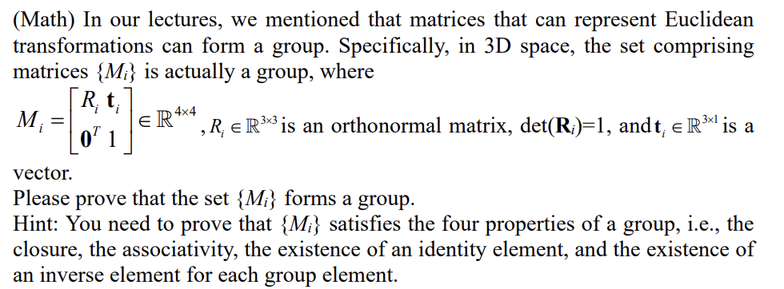

1. Closure
   First, we prove that for any two elements in the set, their product must be in the set
   $$
   \forall \boldsymbol{M_j},\boldsymbol{M_k} \in \set{\boldsymbol{M_i}}
   \\ \boldsymbol{M_j}\boldsymbol{M_k}=\begin{bmatrix}\boldsymbol{R_j} & \bold{t_j}\\ \bold{0^T} &\bold{1}\end{bmatrix}\begin{bmatrix}\boldsymbol{R_k} & \bold{t_k} \\ \bold{0^T} & \bold{1}\end{bmatrix}=\begin{bmatrix}\boldsymbol{R_jR_k}&\boldsymbol{R_j}\bold{t_k}+\bold{t_j}\\ \bold{0^T}&\bold{1}\end{bmatrix} \\
   \because\boldsymbol{R_jR_k}\in\mathbb{R}^{3\times 3},\boldsymbol{R_j}\bold{t_k}+\bold{t_j}\in\mathbb{R}^{3\times 1},\det(\boldsymbol{R_jR_k})=\det(\boldsymbol{R_j})\det(\boldsymbol{R_k})=1 \\
   \therefore \boldsymbol{M_jM_k}\in\set{\boldsymbol{M_i}}
   $$
   
2. Associativity
   Then, we prove that the order in which operations are performed does not matter.
   $$
   \forall \boldsymbol{M_j},\boldsymbol{M_k},\boldsymbol{M_l} \in \set{\boldsymbol{M_i}} \\
   (\boldsymbol{M_j}\boldsymbol{M_k})\boldsymbol{M_l}=\begin{bmatrix}\boldsymbol{R_jR_k}&\boldsymbol{R_j}\bold{t_k}+\bold{t_j}\\ \bold{0^T}&\bold{1}\end{bmatrix}\begin{bmatrix}\boldsymbol{R_l} & \bold{t_l}\\ \bold{0^T} &\bold{1}\end{bmatrix}=\begin{bmatrix}\boldsymbol{R_jR_k}\boldsymbol{R_l} &\boldsymbol{R_jR_k} \bold{t_l}+\boldsymbol{R_j}\bold{t_k}+\bold{t_j}\\ \bold{0^T} &\bold{1}\end{bmatrix} \\
   \boldsymbol{M_j}(\boldsymbol{M_k}\boldsymbol{M_l})=\begin{bmatrix}\boldsymbol{R_j}&\bold{t_j}\\ \bold{0^T}&\bold{1}\end{bmatrix}\begin{bmatrix}\boldsymbol{R_kR_l}&\boldsymbol{R_k}\bold{t_l}+\bold{t_k}\\ \bold{0^T}&\bold{1}\end{bmatrix}=\begin{bmatrix}\boldsymbol{R_jR_k}\boldsymbol{R_l} &\boldsymbol{R_jR_k} \bold{t_l}+\boldsymbol{R_j}\bold{t_k}+\bold{t_j}\\ \bold{0^T} &\bold{1}\end{bmatrix} \\
   (\boldsymbol{M_j}\boldsymbol{M_k})\boldsymbol{M_l}=\boldsymbol{M_j}(\boldsymbol{M_k}\boldsymbol{M_l})
   $$
   
3. Identity

   We need to find a matrix from the set which have the properties of identity.
   consider the matrix below
   $$
   \boldsymbol{I}=\begin{bmatrix}
   \boldsymbol{E_3} & \bold{0} \\
   \bold{0^T} & \bold{1}
   \end{bmatrix} \in \boldsymbol{M_i}
   $$
   we have
   $$
   \forall\boldsymbol{M_j}\in\set{\boldsymbol{M_i}} \\
   \boldsymbol{M_j}\boldsymbol{I}=\begin{bmatrix}\boldsymbol{R_j} & \bold{t_j}\\ \bold{0^T} &\bold{1}\end{bmatrix}\begin{bmatrix}
   \boldsymbol{E_3} & \bold{0} \\
   \bold{0^T} & \bold{1}
   \end{bmatrix}=\boldsymbol{M_j}= 
   \begin{bmatrix}
   \boldsymbol{E_3} & \bold{0} \\
   \bold{0^T} & \bold{1}
   \end{bmatrix}\begin{bmatrix}\boldsymbol{R_j} & \bold{t_j}\\ \bold{0^T} &\bold{1}\end{bmatrix}= \\
   \boldsymbol{I}\boldsymbol{M_j}
   $$
   So, $\boldsymbol{I}$ is the identity of this set.

4. Inverse
   We prove for any element in the set, we can construct a matrix satisfied the properties of inverse.
   $$
   \forall \boldsymbol{M_j}\in\set{\boldsymbol{M_i}}  \\
   \boldsymbol{M_j}=\begin{bmatrix}\boldsymbol{R_j} & \bold{t_j}\\ \bold{0^T} &\bold{1}\end{bmatrix}
   $$
   we construct the matrix below
   $$
   \because \det(\boldsymbol{R_j})=1\ne0 \\
   \therefore \exist \boldsymbol{R_j^{-1}},\det(\boldsymbol{R_j^{-1}})=1\quad s.t.\quad
   \boldsymbol{R_j}\boldsymbol{R_j^{-1}}=\boldsymbol{R_j^{-1}}\boldsymbol{R_j}=\boldsymbol{E}\\
   \exist\boldsymbol{M_j^{-1}}=\begin{bmatrix}
   \boldsymbol{R_j^{-1}}&-\boldsymbol{R_j^{-1}}\bold{t_j} \\
   \bold{0^T}&\bold{1}
   \end{bmatrix}\in\set{\boldsymbol{M_i}}
   $$
   then, we prove $\boldsymbol{M_j^{-1}}$ is inverse of $\boldsymbol{M_j}$
   $$
   \boldsymbol{M_jM_j^{-1}}=\begin{bmatrix}\boldsymbol{R_j} & \bold{t_j}\\ \bold{0^T} &\bold{1}\end{bmatrix}
   \begin{bmatrix}
   \boldsymbol{R_j^{-1}}&-\boldsymbol{R_j^{-1}}\bold{t_j} \\
   \bold{0^T}&\bold{1}
   \end{bmatrix}=\begin{bmatrix}
   \boldsymbol{R_j}\boldsymbol{R_j^{-1}}&-\boldsymbol{R_j}\boldsymbol{R_j^{-1}}\bold{t_j}+\bold{t_j} \\
   \bold{0^T}&\bold{1}
   \end{bmatrix}=
   \begin{bmatrix}
   \boldsymbol{E} & -\boldsymbol{E}\bold{t_j}+\bold{t_j} \\
   \bold{0^T}&\bold{1}
   \end{bmatrix}=
   \begin{bmatrix}
   \boldsymbol{E}&\bold{0} \\
   \bold{0^T}&\bold{1}
   \end{bmatrix}=\boldsymbol{I} \\ 
   \boldsymbol{M_j^{-1}}\boldsymbol{M_j}=
   \begin{bmatrix}
   \boldsymbol{R_j^{-1}}&-\boldsymbol{R_j^{-1}}\bold{t_j} \\
   \bold{0^T}&\bold{1}
   \end{bmatrix}
   \begin{bmatrix}\boldsymbol{R_j} & \bold{t_j}\\ \bold{0^T} &\bold{1}\end{bmatrix}=
   \begin{bmatrix}
   \boldsymbol{R_j^{-1}R_j}&\boldsymbol{R_j^{-1}}\bold{t_j}-\boldsymbol{R_j^{-1}}\bold{t_j} \\
   \bold{0^T}&\bold{1}
   \end{bmatrix}=
   \begin{bmatrix}
   \boldsymbol{E}&\bold{0} \\
   \bold{0^T}&\bold{1}
   \end{bmatrix}=\boldsymbol{I} \\ 
   \because \boldsymbol{M_jM_j^{-1}}=\boldsymbol{M_j^{-1}M_j}=\boldsymbol{I}
   \therefore \boldsymbol{M_j^{-1}} \ is \ inverse\ of \ \boldsymbol{M_j}
   $$

Based on the four properties mentioned above, the set $\set\boldsymbol{M_i}$ forms a group.

## 2

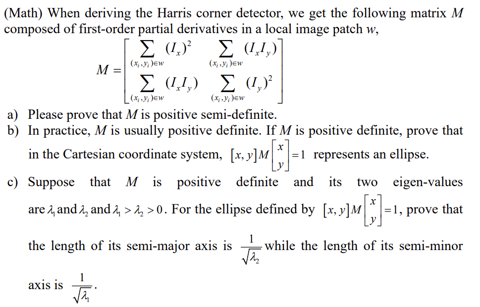

 

- a
  $$
  \forall \boldsymbol{v}\in\mathbb{R}^{2\times 1}\quad 
  \boldsymbol{v}=\begin{bmatrix}x\\y\end{bmatrix}\\
  \boldsymbol{v^T}\boldsymbol{M}\boldsymbol{v}=
  \begin{bmatrix}
  x&y
  \end{bmatrix}
  \begin{bmatrix}
  \sum_{(x_i,y_i)\in w}{(I_x)^2} &\sum_{(x_i,y_i)\in w}{(I_xI_y)} \\
  \sum_{(x_i,y_i)\in w}{(I_xI_y)} &\sum_{(x_i,y_i)\in w}{(I_y)^2}
  \end{bmatrix}
  \begin{bmatrix}
  x \\ y
  \end{bmatrix} \\
  =\begin{bmatrix}
  x\sum_{(x_i,y_i)\in w}{(I_x)^2}+y\sum_{(x_i,y_i)\in w}{(I_xI_y)} &
  x\sum_{(x_i,y_i)\in w}{(I_xI_y)}+y\sum_{(x_i,y_i)\in w}{(I_y)^2}
  \end{bmatrix}
  \begin{bmatrix}
  x \\y
  \end{bmatrix} \\
  =x^2\sum_{(x_i,y_i)\in w}{(I_x)^2}+xy\sum_{(x_i,y_i)\in w}{(I_xI_y)}+xy\sum_{(x_i,y_i)\in w}{(I_xI_y)}+y^2\sum_{(x_i,y_i)\in w}(I_y)^2 \\
  =\sum_{(x_i,y_i)\in w}{x^2(I_x)^2+2xy(I_xI_y)+y^2(I_y)^2} \\
  =\sum_{(x_i,y_i)\in w}{(xI_x+yI_y)^2} \ge 0
  $$
  According to the decision theorem, $\boldsymbol{M}$ is a positive semi-definite matrix.
  
- b
  $\boldsymbol{M}$ is positive definite, we assume its eigen-values is $\lambda_1,\lambda_2 >0$, their corresponding eigen-vectors are orthogonal, we record the normalized eigen-vectors as $\mu_1,\mu_2$, $A=[\mu_1 \ \mu_2]$ is orthogonal matrix.
  Accroding to positive definite matrix's properties
  $$
  \boldsymbol{M}=\boldsymbol{A}\begin{bmatrix}\lambda_1&0\\0&\lambda_2\end{bmatrix}\boldsymbol{A^T}
  $$
  let $\boldsymbol{v}=\begin{bmatrix}x\\y\end{bmatrix}$, we have
  $$
  \boldsymbol{v^T}\boldsymbol{M}\boldsymbol{v}=\boldsymbol{v^TA}\begin{bmatrix}\lambda_1&0\\0&\lambda_2\end{bmatrix}\boldsymbol{A^Tv}=(\boldsymbol{A^Tv})^T\begin{bmatrix}\lambda_1&0\\0&\lambda_2\end{bmatrix}(\boldsymbol{A^Tv})=1
  $$
  let $\boldsymbol{v'}=\begin{bmatrix}x'\\y'\end{bmatrix},\boldsymbol{v'}=(\boldsymbol{A^Tv})$
  $$
  \boldsymbol{v'}^T\begin{bmatrix}\lambda_1&0\\0&\lambda_2\end{bmatrix}\boldsymbol{v'}=
  \begin{bmatrix}x'&y'\end{bmatrix}\begin{bmatrix}\lambda_1&0\\0&\lambda_2\end{bmatrix}\begin{bmatrix}x'\\y'\end{bmatrix}=\lambda_1x'^2+\lambda_2y'^2=1
  $$
  $\lambda_1,\lambda_2>0$, $\boldsymbol{v^T}\boldsymbol{M}\boldsymbol{v}$ represents an ellipse whose major and minor axes are eigen-vectors $\mu_1 ,\mu_2$.
  
- c
  We assume the length of the ellipse's semi-major axis is $a$ , the length of semi-minor axis is $b$. Accroding to question b, we have the ellipse's expression
  $$
  \lambda_1x'^2+\lambda_2y'^2=\frac{x'^2}{\frac{1}{\lambda_1}}+\frac{y'^2}{\frac{1}{\lambda_2}}=1 \\
  a^2=\frac{1}{\lambda_2},b^2=\frac{1}{\lambda_2} \\
  a=\frac{1}{\sqrt{\lambda_2}},b=\frac{1}{\sqrt{\lambda_1}}
  $$
  

## 3

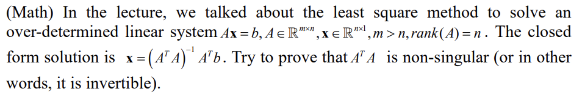

First, we prove that $\boldsymbol{A^TA}$ is a symmetric matrix
$$
(\boldsymbol{A^TA})^T=\boldsymbol{A^T(A^T)^T}=\boldsymbol{A^TA}
$$
for any non-zero vector $\boldsymbol{x}\in\mathbb{R}^{n\times 1}$
$$
\because rank(\boldsymbol{A})=n \\
\therefore \boldsymbol{Ax}\ne0 \\
\because
(\boldsymbol{Ax})^T(\boldsymbol{\boldsymbol{Ax}})=\boldsymbol{x^TA^TAx}=\boldsymbol{x^T}(\boldsymbol{A^TA})\boldsymbol{x}>0 \\
\therefore \boldsymbol{A^TA}\ is\ positive\ definite
$$
According to positive definite matrix's properties, $\boldsymbol{A^TA}$ is non-singular.

## 4

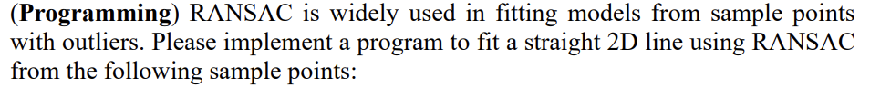

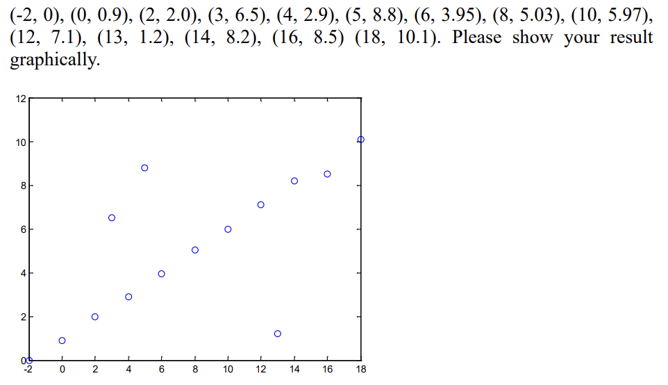

We use python language to implement the program, having the result below, the source code is file `RANSAC.py`.

 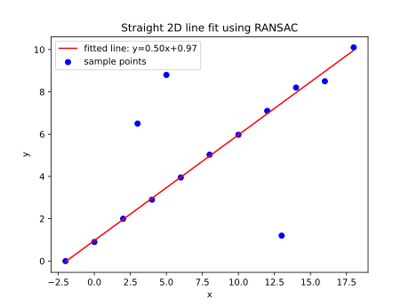

## 5

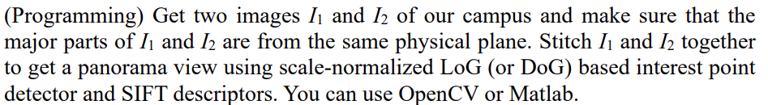

We use the OpenCV 3.4.19 in Linux to implement the panorama stitching using DoG based interest point detector and SIFT descriptors. The program I designed receives two args from command line, the paths of the given images, output the feature point matching before and after filterating the bad matches and the stitch result.

I tested the program with the photos of SSE I took by myself, here is the result:

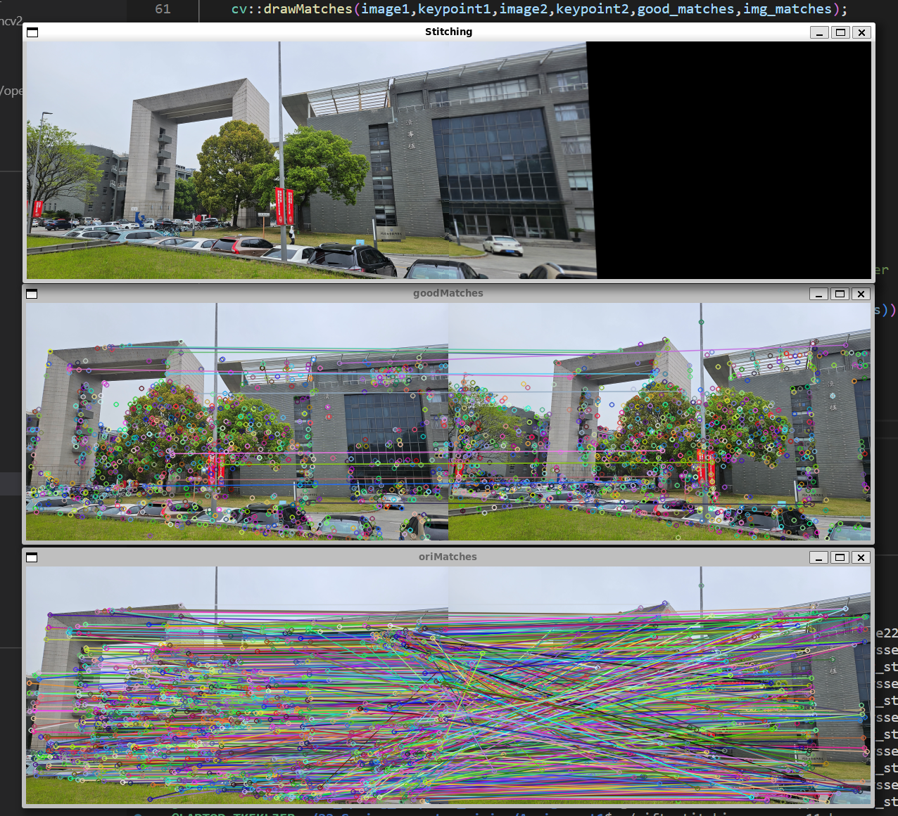

The source code is file `Stitch.cpp`

I also tested my photos using the MATLAB program provided by Pro.Zhang, here is the result:
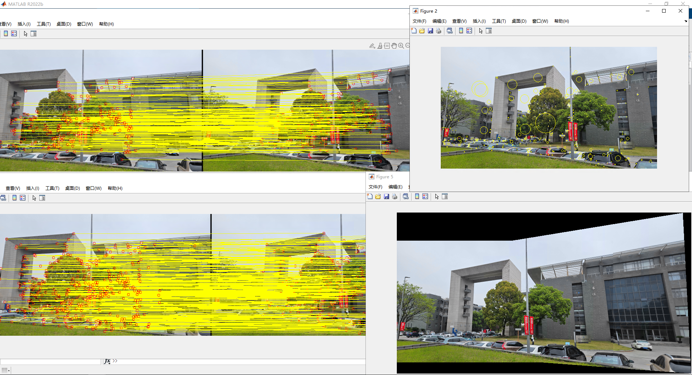

Comparing the two results above, we can find that the number of good matches in my program is much less than Pro.Zhang's program. It may due to I set the filtering threshold to small. The stitching result are similar, which shows the correctness of my program.

To compile and run the code, we should execute the commands below:

```bash
 g++ -std=c++11 Stitch.cpp -o sift_stitching.o `pkg-config --cflags --libs opencv4`
 ./sift_stitching.o mysse11.bmp mysse22.bmp
```


## 6

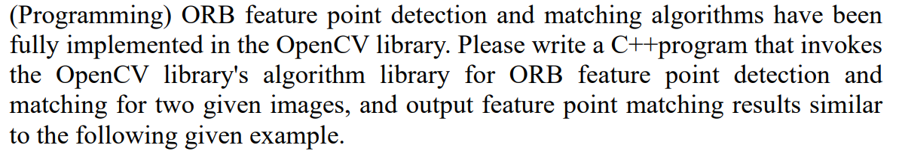

We use the OpenCV 3.4.19 in Linux to implement the ORB feature point detection and matching for two given images. The program I designed receives two args from command line, the paths of the given images, output the feature point matching results.

I tested the program with the photos of SSE I took by myself, here is the result:
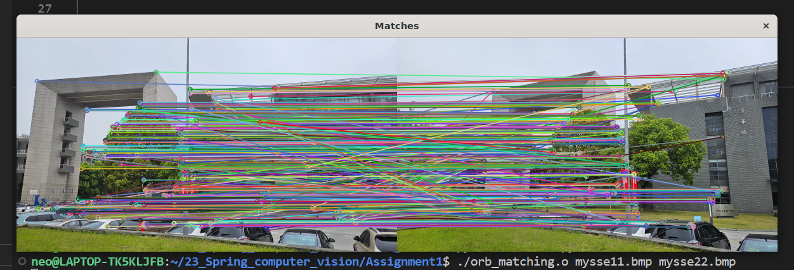 

The source code is file `ORB.cpp`

To compile and run the code, we should execute the commands below:

```bash
g++ -std=c++11 ORB.cpp -o orb_matching.o `pkg-config --cflags --libs opencv4`
./orb_matching.o mysse11.bmp mysse22.bmp
```
