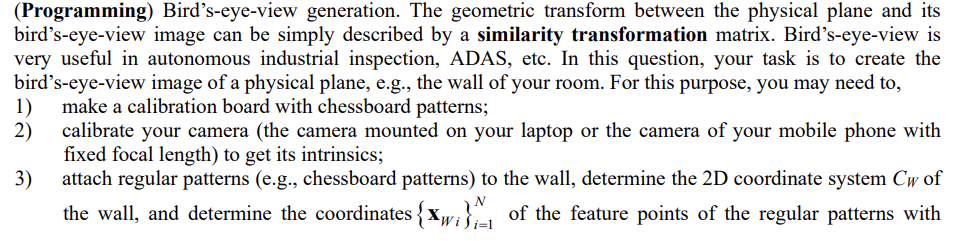
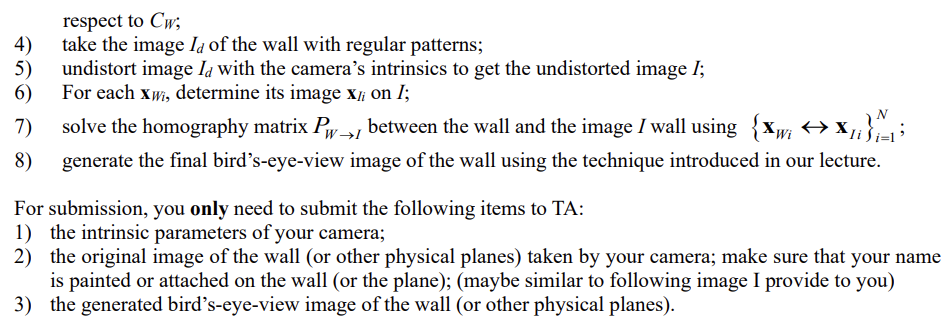
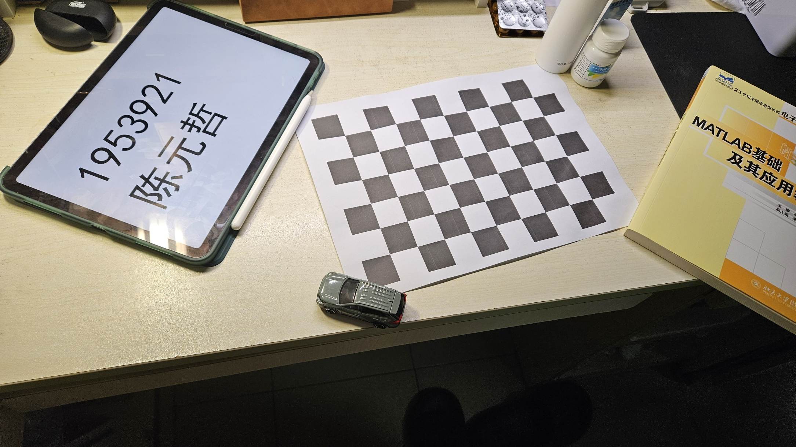
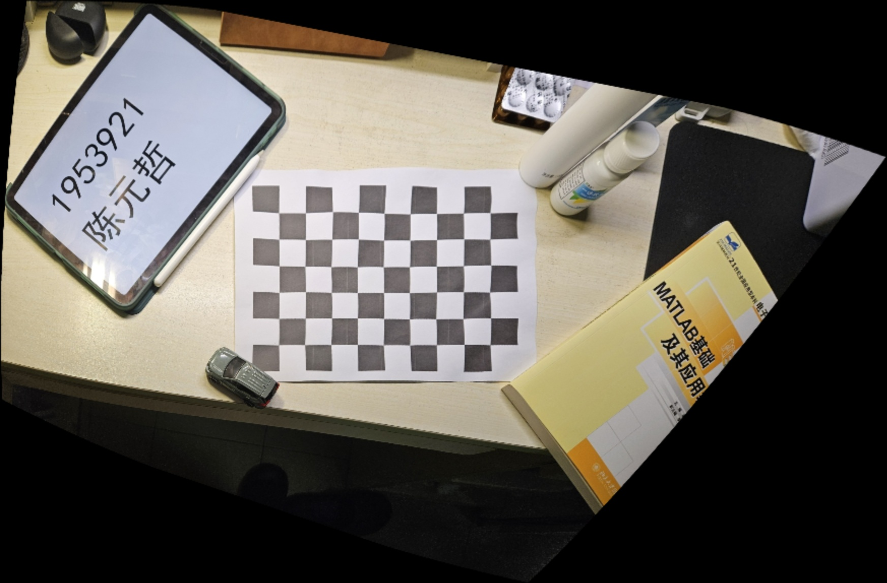

# Assignment2

> Computer Vision 2023 Spring

**1953921 陈元哲**

##  1


The homogeneous coordinate of the line is $x-3y+4z=0$. In the projective plane, a point at infinity is represented by setting $z=0$. We plug $z=0$ into the equation to find the homogeneous coordinates of the infinity point
$$
x-3y=0
$$
let $x=3$, we have $y=1$

Therefore, the homogeneous coordinate of the infinity point is $(3,1,0)$.

## 2


We plug $r^2=x^2+y^2$
$$
\begin{cases}
x_d=x[1+k_1(x^2+y^2)+k_2(x^4+2x^2y^2+y^4)]+2\rho_1xy+\rho_2(3x^2+y^2)+xk_3(x^6+3x^4y^2+3x^2y^4+y^6) \\
y_d=y[1+k_1(x^2+y^2)+k_2(x^4+2x^2y^2+y^4)]+2\rho_2xy+\rho_1(x^2+3y^2)+yk_3(x^6+3x^4y^2+3x^2y^4+y^6)
\end{cases}
$$
$\bold{p}_n=(x,y)^T$ is mapped to $\bold{p}_d=(x_d,y_d)^T$, we have $F: \mathbb{R}_2 \rightarrow \mathbb{R}_2$
$$
\frac{\mathrm{d}\bold{p}_d}{\mathrm{d}\bold{p}_n^T}=J_F(x,y)=
\begin{bmatrix}
\frac{\partial{x_d}}{\partial{x}}&\frac{\partial{x_d}}{\partial{y}} \\
\frac{\partial{y_d}}{\partial{x}}&\frac{\partial{y_d}}{\partial{y}}
\end{bmatrix} \\=
\begin{bmatrix}
\begin{matrix}
1+k_1(3x^2+y^2)+k_2(5x^4+6x^2y^2+y^4)+\\ 2\rho_1y+6\rho_2x+k_3(7x^6+15x^4y^2+9x^2y^4+y^6) 
\end{matrix}
&
\begin{matrix}
2k_1xy+k_2(4x^3y+4xy^3)+\\ 2\rho_1x+2\rho_2y+k_3(6x^5y+12x^3y^3+6xy^5) 
\end{matrix} \\
\begin{matrix}
2k_1xy+k_2(4x^3y+4xy^3)+\\ 2\rho_1x+2\rho_2y+k_3(6x^5y+12x^3y^3+6xy^5) 
\end{matrix}&
\begin{matrix}
1+k_1(x^2+3y^2)+k_2(x^4+6x^2y^2+5y^4)+\\ 2\rho_2x+6\rho_1y+k_3(x^6+9x^4y^2+15x^2y^4+7y^6)
\end{matrix}
\end{bmatrix}\\=
\begin{bmatrix}
\begin{matrix}
1+k_1(2x^2+r^2)+k_2r^2(4x^2+r^2)+\\2\rho_1y+6\rho_2x+k_3r^4(6x^2+r^2)
\end{matrix}
&
2k_1xy+4k_2xyr^2+2\rho_1x+2\rho_2y+6k_3xyr^4 \\
2k_1xy+4k_2xyr^2+2\rho_1x+2\rho_2y+6k_3xyr^4
&
\begin{matrix}
1+k_1(2y^2+r^2)+k_2r^2(4x^2+r^2)+\\2\rho_2x+6\rho_1y+k_3r^4(6y^2+r^2)
\end{matrix}
\end{bmatrix}
$$

## 3


We have
$$
\bold{n}\bold{n}^T=\begin{bmatrix}
n_1^2&n_1n_2&n_1n_3\\
n_1n_2&n_2^2&n_2n_3\\
n_1n_3&n_2n_3&n_3^2
\end{bmatrix}
\quad
\bold{n}^{\wedge}=\begin{bmatrix}
0&-n_3&n_2\\
n_3&0&-n_1\\
-n_2&n_1&0
\end{bmatrix}
$$
We plug them into $\bold{R}$
$$
\bold{R}=\begin{bmatrix}
\cos{\theta}+n_1^2(1-\cos{\theta})&n_1n_2(1-\cos{\theta})-n_3\sin{\theta}&n_1n_3(1-\cos{\theta})+n_2\sin{\theta}\\
n_1n_2(1-\cos{\theta})+n_3\sin{\theta}&\cos{\theta}+n_2^2(1-\cos{\theta})&n_2n_3(1-\cos{\theta})-n_1\sin{\theta}\\
n_1n_3(1-\cos{\theta})-n_2\sin{\theta}&n_2n_3(1-\cos{\theta})+n_1\sin{\theta}&\cos{\theta}+n_3^2(1-\cos{\theta})
\end{bmatrix}
$$
let $\bold{d}=(d_1,d_2,d_3)^T$, we have
$$
\bold{d}=\theta\bold{n}=
\begin{bmatrix}
\theta n_1\\
\theta n_2\\
\theta n_3
\end{bmatrix}=
\begin{bmatrix}
d_1\\d_2\\d_3
\end{bmatrix}
$$

$$
d_i=\theta n_i \quad(i=1,2,3)
$$

$\bold{n}$ is a 3D unit vector, therefore
$$
d_1^2+d_2^2+d_3^2=\theta^2(n_1^2+n_2^2+n_3^2)=\theta^2
$$
We plug the relationship above, have
$$
\frac{\partial \alpha}{\partial d_i}=\frac{\partial \sin{\theta}}{\partial d_i}=\cos{\theta}\frac{\partial\theta}{\partial d_i}=\cos{\theta}\frac{\partial\sqrt{d_1^2+d_2^2+d_3^2}}{\partial d_i}=\cos{\theta}\frac{d_i}{\theta}=n_i\cos{\theta}\\
\frac{\partial \beta}{\partial d_i}=\frac{\partial \cos{\theta}}{\partial d_i}=-\sin{\theta}\frac{\partial\theta}{\partial d_i}=-n_i\sin{\theta}\\
\frac{\partial \gamma}{\partial d_i}=\frac{\partial 1-\cos{\theta}}{\partial d_i}=-\frac{\partial\cos{\theta}}{\partial d_i}=n_i\sin{\theta}\\
\frac{\partial n_i}{\partial d_i}=\frac{\partial\frac{d_i}{\theta}}{\partial d_i}=\frac{\theta-d_i\frac{\partial\theta}{\partial d_i}}{\theta^2}=\frac{\theta-\frac{d_i^2}{\theta}}{\theta^2}=\frac{1-n_i^2}{\theta}\\
\frac{\partial n_j}{\partial d_i}=\frac{\partial\frac{d_j}{\theta}}{\partial d_i}=\frac{-d_j\frac{\partial \theta}{\partial d_i}}{\theta^2}=\frac{-\frac{d_id_j}{\theta}}{\theta^2}=-\frac{n_in_j}{\theta}\quad(i\neq j)
$$
$\bold{d}=(d_1,d_2,d_3)^T$ is mapped to $\bold{r}=(r_{11},r_{12},r_{13},r_{21},r_{22},r_{23},r_{31},r_{32},r_{33})^T$, we have $F:\mathbb{R}_3 \rightarrow \mathbb{R}_9$
$$
\frac{\mathrm{d} \bold{r}}{\mathrm{d} \bold{d}^T}=J_F(r_{11},r_{12},r_{13},r_{21},r_{22},r_{23},r_{31},r_{32},r_{33})\\=
\begin{bmatrix}
\frac{\partial r_{11}}{\partial d_1}&\frac{\partial r_{11}}{\partial d_2}&\frac{\partial r_{11}}{\partial d_3}\\
\frac{\partial r_{12}}{\partial d_1}&\frac{\partial r_{12}}{\partial d_2}&\frac{\partial r_{12}}{\partial d_3}\\
\vdots&\vdots&\vdots\\
\frac{\partial r_{33}}{\partial d_1}&\frac{\partial r_{33}}{\partial d_2}&\frac{\partial r_{33}}{\partial d_3}
\end{bmatrix}\\
=\begin{bmatrix}
n_1(1-n_1^2)(\frac{2\gamma}{\theta}-\alpha)&n_1^2n_2(\alpha-\frac{2\gamma}{\theta})-n_2\alpha&n_1^2n_3(\alpha-\frac{2\gamma}{\theta})-n_3\alpha\\
n_1^2n_2(\alpha-\frac{2\gamma}{\theta})+n_1n_3(\frac{\alpha}{\theta}-\beta)+n_2\frac{\gamma}{\theta}&n_1n_2^2(\alpha-\frac{2\gamma}{\theta})+n_2n_3(\frac{\alpha}{\theta}-\beta)+n_1\frac{\gamma}{\theta}&n_1n_2n_3(\alpha-\frac{2\gamma}{\theta})-(1-n^3)\frac{\alpha}{\theta}-n_3^2\beta\\
n_1^2n_3(\alpha-\frac{2\gamma}{\theta})-n_1n_2(\frac{\alpha}{\theta}-\beta)+n_3\frac{\gamma}{\theta}&n_1n_2n_3(\alpha-\frac{2\gamma}{\theta})+(1-n_2^2)\frac{\alpha}{\theta}+n_2^2\beta&n_1n_3^2(\alpha-\frac{2\gamma}{\theta})-n_2n_3(\frac{\alpha}{\theta}-\beta)+n_1\frac{\gamma}{\theta}\\
n_1^2n_2(\alpha-\frac{2\gamma}{\theta})-n_1n_3(\frac{\alpha}{\theta}-\beta)+n_2\frac{\gamma}{\theta}&n_1n_2^2(\alpha-\frac{2\gamma}{\theta})-n_2n_3(\frac{\alpha}{\theta}-\beta)+n_1\frac{\gamma}{\theta}&n_1n_2n_3(\alpha-\frac{2\gamma}{\theta})+(1-n^3)\frac{\alpha}{\theta}+n_3^2\beta\\
n_1n_2^2(\alpha-\frac{2\gamma}{\theta})-n_1\alpha&n_2(1-n_2^2)(\frac{2\gamma}{\theta}-\alpha)&n_2^2n_3(\alpha-\frac{2\gamma}{\theta})-n_3\alpha\\
n_1n_2n_3(\alpha-\frac{2\gamma}{\theta})-(1-n_1^2)\frac{\alpha}{\theta}-n_1^2\beta&n_2^2n_3(\alpha-\frac{2\gamma}{\theta})+n_1n_2(\frac{\alpha}{\theta}-\beta)+n_3\frac{\gamma}{\theta}&n_2n_3^2(\alpha-\frac{2\gamma}{\theta})+n_1n_3(\frac{\alpha}{\theta}-\beta)+n_2\frac{\gamma}{\theta}\\
n_1^2n_3(\alpha-\frac{2\gamma}{\theta})+n_1n_2(\frac{\alpha}{\theta}-\beta)+n_3\frac{\gamma}{\theta}&n_1n_2n_3(\alpha-\frac{2\gamma}{\theta})-(1-n_2^2)\frac{\alpha}{\theta}-n_2^2\beta&n_1n_3^2(\alpha-\frac{2\gamma}{\theta})+n_2n_3(\frac{\alpha}{\theta}-\beta)+n_1\frac{\gamma}{\theta}\\
n_1n_2n_3(\alpha-\frac{2\gamma}{\theta})+(1-n_1^2)\frac{\alpha}{\theta}+n_1^2\beta&n_2^2n_3(\alpha-\frac{2\gamma}{\theta})-n_1n_2(\frac{\alpha}{\theta}-\beta)+n_3\frac{\gamma}{\theta}&n_2n_3^2(\alpha-\frac{2\gamma}{\theta})-n_1n_3(\frac{\alpha}{\theta}-\beta)+n_2\frac{\gamma}{\theta}\\
n_1n_3^2(\alpha-\frac{2\gamma}{\theta})-n_1\alpha&n_2n_3^2(\alpha-\frac{2\gamma}{\theta})-n_2\alpha&n_3(1-n_3^2)(\alpha-\frac{2\gamma}{\theta})
\end{bmatrix}
$$

## 4





### Where is my submisson

1. the intrinsic parameters of my camera

In the file `camera_intrinsic.txt`，here is the content

```txt
Camera Matrix:
[1658.360919958824, 0, 1210.66914163179;
 0, 1626.412676277487, 556.1001190421206;
 0, 0, 1]
Distortion Coefficients:
[-0.2582572766295772, 1.287844698344425, 0, 0, -0.8617458966204036]
```

2. the original image of the physical planes taken by my camera

In the file `input.jpg`



3. the generated BEV image

In the file `result.jpg`




And the source code is in file `BEV.cpp`
