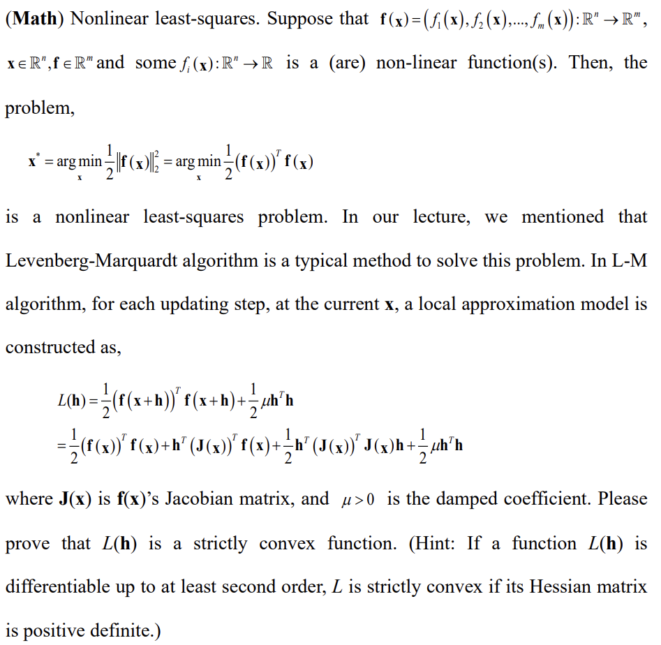
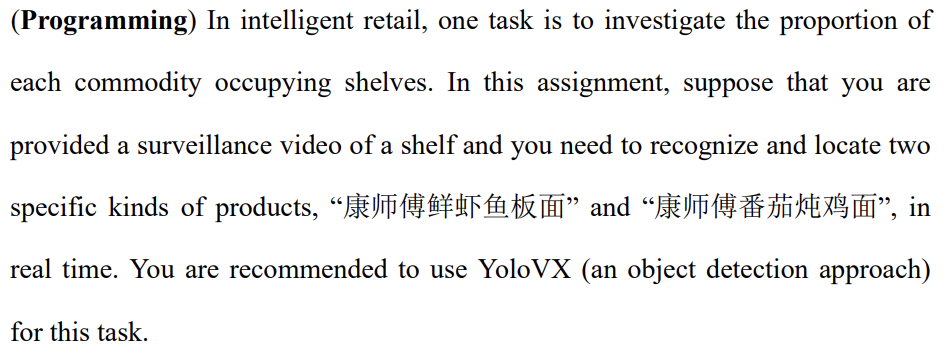
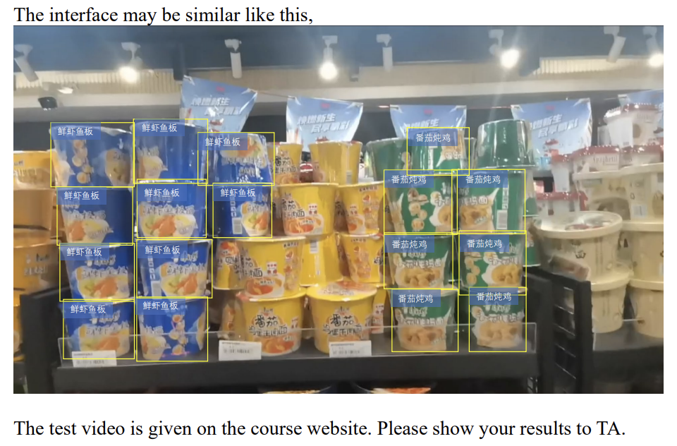
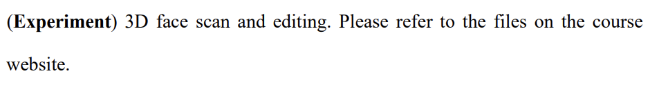

# Assignment3

> Computer Vision 2023 Spring

## 1 

We have $\bold{h}\in\mathbb{R}^n$ and $L(\bold{h})$ is differentiable at second order. $L\in\mathbb{R}^n$, therefore
$$
\nabla L(\bold{h})=(J(\bold{x}))^Tf(x)+\frac{1}{2}((J(\bold{x}))^TJ(\bold{x})+((J(\bold{x}))^TJ(\bold{x}))^T)\bold{h}+\mu\bold{h}\\
=(J(\bold{x}))^Tf(x)+(J(\bold{x}))^TJ(\bold{x})\bold{h}+\mu\bold{h} \\
\nabla^2L(\bold{h})=(J(\bold{x}))^TJ(\bold{x})+\mu\bold{I}
$$
For, $\forall \bold{y}\in\mathbb{R}^n, \bold{y} \neq \bold{0}$ ,we have
$$
\bold{y}^T\nabla^2L(\bold{h})\bold{y}=\bold{y}^T(J(\bold{x}))^TJ(\bold{x})y+\mu\bold{y}^T\bold{y}={\|J(\bold{x})\bold{y}\|}_2^2+\mu{\|\bold{y}\|}_2^2
$$
since $\mu > 0$,
$$
{\|J(\bold{x})\bold{y}\|}_2^2\ge 0\quad\mu\bold{y}^T\bold{y}>0 \Rightarrow \bold{y}^T\nabla^2 L(\bold{h})\bold{y} >0
$$
therefore, $\nabla^2L(\bold{h})>0$

$L(\bold{h})$ is strictly convex.

## 2

The result test video is file `1953921_supermarketvideo.mp4`.

## 3

The experiment report is file `1953921_report.pdf`.

The fixed wavefront is file `1953921chenyuanzhe_fixed.obj`.