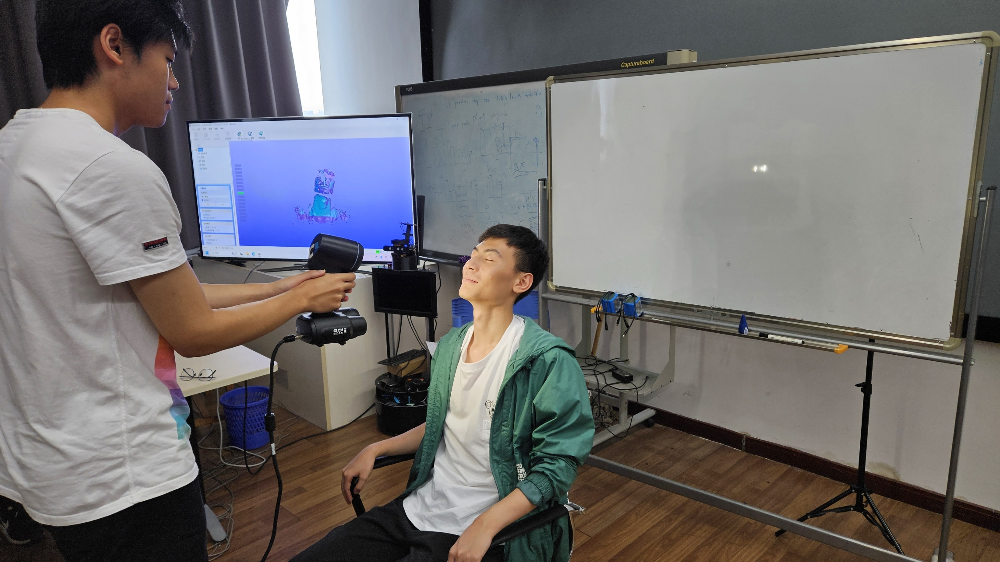
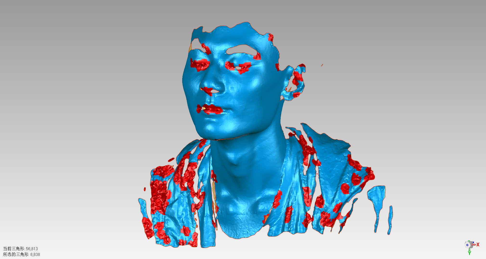
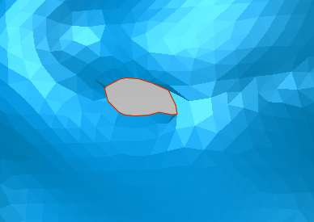
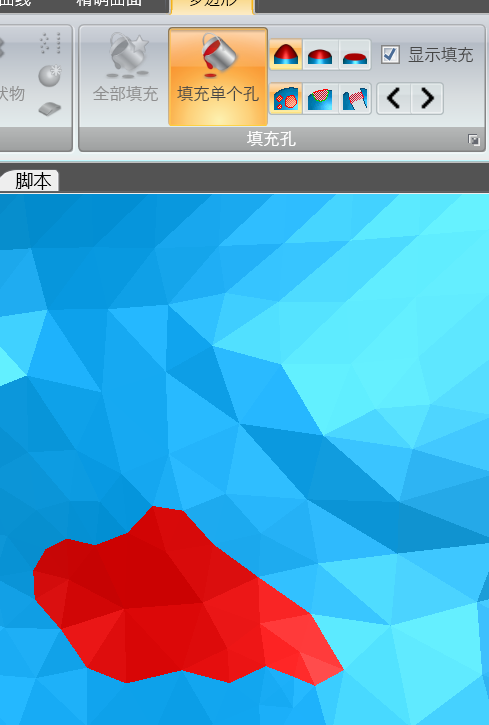
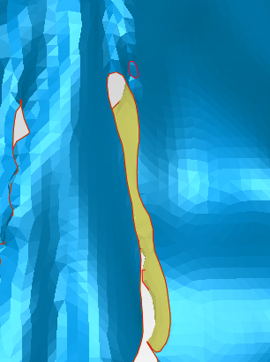
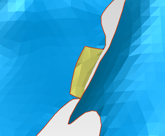
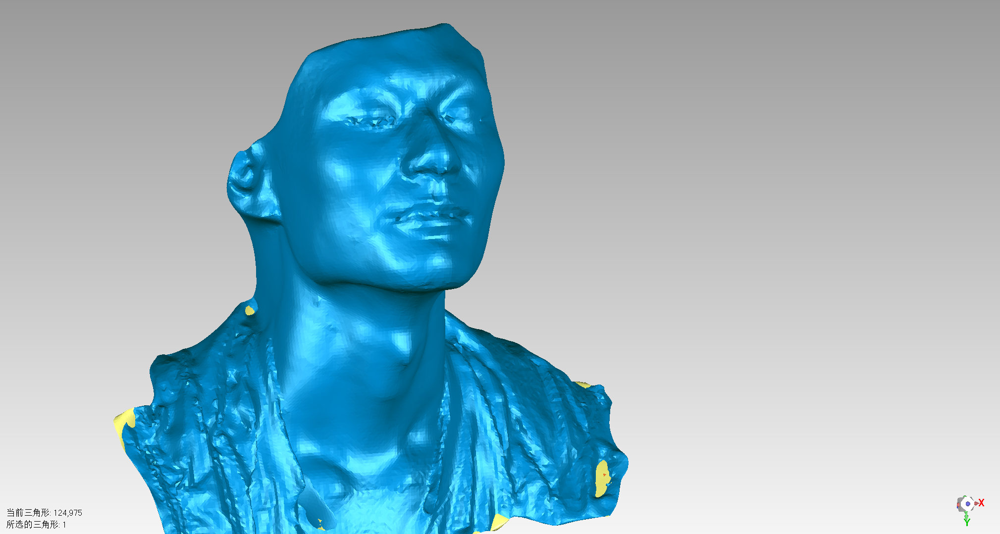

# 实验报告

姓名：陈元哲

学号：1953921

## 一、实验名称

三维模型扫描与数据处理

## 二、实验目的

1. 了解三维模型数据的表示形式和存储格式
2. 掌握手持式三维曲面扫描系统 Creaform Go Scan 3D 硬件和软件的使用方式
3. 掌握常用几何编辑软件（比如 GeoMagic Studio）的操作方式，能够对原 始三维扫描数据进行简单编辑

## 三、实验设备

1. 硬件：Creaform Go Scan 3D 三维扫描仪
2. 软件：Creaform Go Scan 3D 配套扫描软件
3. 软件：Geomagic Wrap 2021

## 四、实验步骤

### 1 三维扫描仪数据采集流程

1. 实验准备

将Creaform Go Scan 3D扫描仪链接上位机，并开启其配套VXelements 三维扫描软件。

2. 数据采集

实验需要两位同学一组，一名同学为数据被采集者，在椅子上略微保持抬头不动，另一位同学为书采集采集者，手持扫描仪，经过各个角度扫描后得到被采集者的人脸模型。需要注意的是，扫描仪的采集光线比较刺眼，被采集者需要全程紧闭双眼。

在采集过程中，被采集者需要使扫描仪与被采集者保持合适的距离。扫描仪上共有三个LED 指示灯用于表示当前扫描仪距离对象的位置：若前指示灯为红色，说明扫描仪距扫描对象过近，需要向后移动；若后指示灯为红色，说明扫描仪距扫描对象过远，需要向前移动；中间指示灯为绿色时说明扫描仪与扫描对象的距离适中。监视器上有信息更详细的红绿灯条，与指示灯起到相同的作用。

扫描仪采集数据同时，扫描仪的配套软件进行实时表面重构。其中紫色部分代表已经生成的模型，浅绿色部分代表当前扫描仪正扫描到的位置，而深蓝色代表跟踪丢失。

3. 文件导出

在使用扫描仪时，需要尽量减少监视器中人脸模型的空洞，但有些空洞无法在采集过程中被修补，需要我们导出`.obj`文件，使用三维模型处理软件进行下一步的后处理。

### 2 三维模型的后处理

1. 使用软件

我在三维模型的后处理中使用的软件是Geomagic Wrap 2021，这是一款由3D Systems公司开发的3D扫描数据处理软件。其支持，数据导入、数据清理、3D建模、测量和分析以及3D可视化。

2. 模型导入

我们在Geomagic软件中，直接打开我们扫描得到的`.obj`文件

可以看到，我们扫描的结果中，面片缺陷较多，需要我们手动补全

3. 模型修补

我使用了下面几个方法来处理我的模型

- 快速光顺
  使模型更加平整
- 孔位填充

- 法向相反修复

4. 修复效果与导出

在重复上述步骤之后，我们得到了修复好的面片文件，我们选择`Wavefront(*.obj)`文件格式进行保存，便于之后对模型的查看与再修改。